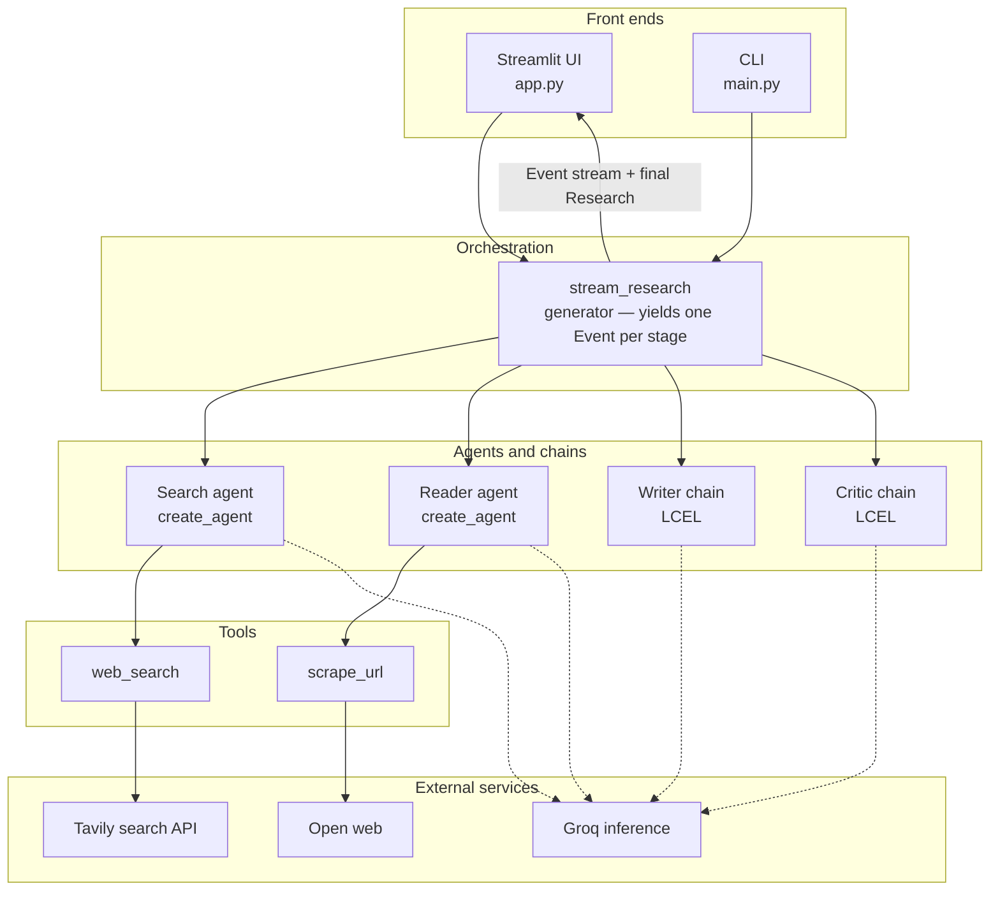
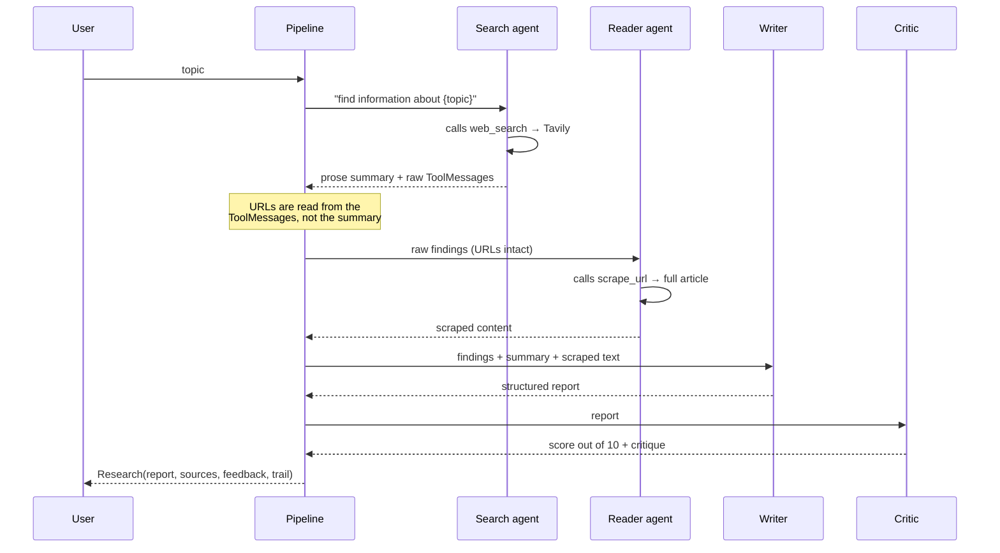

# Multi-Agent Research

A research assistant built from four cooperating agents. Give it a topic and it
searches the open web, reads the strongest source in full, drafts a cited
report, then critiques its own draft — with every intermediate step visible.

<p>
  
  
  
  
  
</p>

---

## Contents

- [What it does](#what-it-does)
- [Screenshots](#screenshots)
- [Architecture](#architecture)
- [How a run works](#how-a-run-works)
- [Technology](#technology)
- [Installation](#installation)
- [Configuration](#configuration)
- [Running](#running)
- [Project layout](#project-layout)
- [Design decisions](#design-decisions)
- [Extending it](#extending-it)
- [Troubleshooting](#troubleshooting)
- [Limitations](#limitations)
- [Roadmap](#roadmap)

---

## What it does

You give it a research topic. Four specialists then run in sequence, each
handing its output to the next:

| # | Stage | What it is | Capability | Responsibility |
|---|-------|------------|-----------|----------------|
| 1 | **Search** | Tool-calling agent | `web_search` — Tavily | Finds recent, credible sources and reports them with URLs intact |
| 2 | **Read** | Tool-calling agent | `scrape_url` — trafilatura | Picks the single strongest source and reads the full article, not the snippet |
| 3 | **Write** | LCEL chain | — | Synthesises a structured, cited report from everything gathered |
| 4 | **Critique** | LCEL chain | — | Scores the draft out of 10 and names concrete weaknesses |

Stages 1 and 2 are genuine agents: they hold a tool and decide for themselves
whether and how to call it. Stages 3 and 4 are deterministic prompt chains —
there is nothing for them to decide, so making them agents would add failure
modes and latency without buying anything.

**Key features**

- **Live stage tracing.** Each stage streams into its own collapsible panel as
  it completes, so you watch the pipeline work rather than staring at a spinner.
- **Real citations.** Source URLs are extracted from raw tool output rather than
  the model's prose, so they survive the handoff between stages instead of being
  summarised away.
- **Full research trail.** A dedicated tab exposes the search summary, the raw
  tool response, and the scraped article text — the evidence behind the report.
- **Self-critique.** The pipeline grades its own output and surfaces the score
  as a headline metric, so a weak run is obvious rather than hidden.
- **Model switching.** Any of five tool-calling Groq models, selectable at run
  time along with temperature.
- **Two front ends, one pipeline.** A Streamlit UI and a CLI share a single
  orchestration path; neither reimplements the other.
- **Markdown export.** Download any report with its sources appended.

---

## Screenshots

> **TODO:** drop PNGs into `docs/` and link them here. A screenshot of the
> results view — stat row plus the Report tab — is the single highest-value
> addition to this README.

---

## Architecture



The important structural choice is the **generator boundary**. Orchestration
knows nothing about Streamlit, and the front ends know nothing about LangChain:

```python
def stream_research(topic, model, temperature) -> Iterator[Event | Research]:
    ...
```

It yields an `Event(stage, status, content)` on every transition and a final
`Research` dataclass holding the complete result. The CLI prints those events;
the UI renders them as live status panels. Adding a third front end — an API, a
notebook, a Discord bot — means consuming the same generator.

---

## How a run works



Each arrow back to the pipeline emits an `Event`, which is what makes the UI
update stage by stage instead of all at once at the end.

---

## Technology

| Layer | Choice | Version | Why |
|-------|--------|---------|-----|
| Language | Python | 3.13 | — |
| Packaging | [uv](https://docs.astral.sh/uv/) | `uv_build` backend | Fast resolution, lockfile-backed reproducibility, src layout |
| Agent framework | LangChain | 1.3.14 | `create_agent()` on LangGraph; native tool calling |
| Agent runtime | LangGraph | 1.2.10 | Graph execution underneath `create_agent` |
| LLM provider | Groq via `langchain-groq` | 1.1.3 | Very low latency, generous free tier, OpenAI-compatible tool calling |
| Default model | `llama-3.3-70b-versatile` | — | Reliable tool calling; four alternatives selectable in the UI |
| Web search | Tavily via `tavily-python` | 0.7.27 | Search API built for LLM consumption — returns clean content, not SERP HTML |
| Content extraction | trafilatura | 2.2.0 | Strips navigation, ads and cookie banners; keeps the article body |
| HTTP | requests | 2.34.2 | Fetch with a real user agent before extraction |
| UI | Streamlit | 1.61.1 | Fastest path from Python pipeline to a shareable web app |
| Config | python-dotenv | 1.2.2 | `.env` for keys, git-ignored |
| Console output | rich | 15.0.0 | Readable CLI traces |

---

## Installation

**Prerequisites**

- Python 3.13 or newer
- [uv](https://docs.astral.sh/uv/getting-started/installation/)
- A Groq API key and a Tavily API key (both have free tiers)

```bash
# 1. Clone
git clone <your-repo-url>
cd multi_agent_research

# 2. Install dependencies into a managed virtualenv
uv sync
```

`uv sync` reads `pyproject.toml`, resolves against `uv.lock`, creates `.venv`,
and installs the project itself in editable mode — so `multi_agent_research` is
importable and the console script is on the path. No manual `venv` activation
is needed; every command below is prefixed with `uv run`.

---

## Configuration

```bash
cp .env.example .env
$EDITOR .env
```

| Variable | Used for | Get one at |
|----------|----------|------------|
| `GROQ_API_KEY` | Chat model inference | [console.groq.com](https://console.groq.com/keys) |
| `TAVILY_API_KEY` | Web search | [app.tavily.com](https://app.tavily.com) |

`.env` is git-ignored. `.env.example` documents the variable names without the
values — copy it, never commit the filled-in version. The Streamlit sidebar
shows a live ✅/❌ for each key so a missing one is obvious before you run.

Theme and server settings live in `.streamlit/config.toml`.

---

## Running

**Web UI** — the primary interface:

```bash
uv run streamlit run app.py
```

Serves on `http://localhost:8501` — open it yourself, since `.streamlit/config.toml`
sets `headless = true` and so suppresses the browser auto-launch and the
first-run email prompt. Enter a topic (or click an example), pick a
model in the sidebar, and press **Run research**. Stages appear as they
complete; results land in four tabs — Report, Sources, Critique, Research trail.

**Command line** — same pipeline, printed to stdout:

```bash
uv run multi-agent-research                            # built-in default topic
uv run multi-agent-research "your topic here"          # your topic
uv run python -m multi_agent_research.main "topic"     # module form
```

A run takes roughly 30–90 seconds depending on the model and how long the
scraped page is.

---

## Project layout

```
.
├── app.py                         Streamlit UI — layout, styling, event rendering
├── .streamlit/config.toml         Theme and server settings
├── .env.example                   Required keys, without the values
├── pyproject.toml                 Dependencies and console script entry point
├── uv.lock                        Resolved, reproducible dependency graph
└── src/multi_agent_research/
    ├── main.py                    CLI entry point
    ├── agents/agents.py           Model factory, agent builders, prompt chains
    ├── tools/tools.py             web_search and scrape_url
    └── pipelines/pipeline.py      Orchestration, Event/Research types, URL extraction
```

**Where to look first:** `pipelines/pipeline.py` is the heart of the project —
it defines the stages, the handoffs, and the data contract both front ends
consume.

---

## Design decisions

These are the choices worth defending in a code review.

**Citations come from tool output, not agent prose.**
An agent's closing message is a summary, and summaries routinely drop URLs. The
first version passed `messages[-1].content` to the next stage, so the reader
agent received text with no links, had nothing to scrape, and the report cited
organisation names instead of sources. `_tool_output()` now reads the
`ToolMessage`s directly — the only place the links survive intact. This single
change took recovered sources per run from 0 to 5.

**Only two of the four stages are agents.**
Agency costs latency, tokens and determinism. The writer and critic have no
decision to make and no tool to call, so they are plain LCEL chains
(`prompt | llm | StrOutputParser`). Reserve agents for the stages that genuinely
need to choose.

**The chat model is built lazily.**
`get_llm()` is a function, not a module-level singleton. Constructing `ChatGroq`
requires `GROQ_API_KEY`; doing that at import time turns a missing key into an
`ImportError` from deep in a traceback instead of a message the UI can render.

**Orchestration is a generator, not a callback.**
`stream_research()` yields events rather than accepting an `on_progress`
callback. The pipeline stays synchronous and testable, front ends stay free to
render however they like, and there is no inversion of control to reason about.

**Tool docstrings are prompts.**
`create_agent` sends a function's docstring to the model as the tool
description. It is the *only* thing the model knows about the tool, so the
docstrings in `tools.py` are written for the model, not for a human reader.

**Tools fail soft.**
`scrape_url` returns its error as a string rather than raising. An agent can
read a string and try something else; an exception ends its turn.

**`starlette<1.4` is pinned deliberately.**
Streamlit 1.61 calls Starlette's `GZipResponder` without the
`thread_minimum_size` argument that Starlette 1.4 made required, so every
gzipped request — meaning every browser request — returns a 500. Streamlit's own
pin is too loose to prevent it. Remove the pin once that is fixed upstream.

---

## Extending it

**Add a tool.** Write a plain function in `tools/tools.py` with a
model-facing docstring, then pass it in the `tools=[...]` list of an agent
builder. LangChain converts callables automatically — no decorator required.

**Add a pipeline stage.** Append an entry to `STAGES` in `pipeline.py`, add a
field to the `Research` dataclass, then `yield Event("key", "start")` /
`yield Event("key", "done", content)` around the work. Both front ends pick up
the new stage with no changes — the CLI prints it and the UI renders a panel.

**Swap the provider.** Replace `ChatGroq` in `get_llm()` with any LangChain
chat model that supports tool calling, and update `AVAILABLE_MODELS`.

---

## Troubleshooting

| Symptom | Cause and fix |
|---------|---------------|
| `❌ GROQ_API_KEY` in the sidebar | `.env` missing or unfilled. Copy `.env.example` and add your keys. |
| Every browser request 500s | The `starlette<1.4` pin was removed. Restore it. |
| `ModuleNotFoundError: multi_agent_research` | Run `uv sync` — the project must be installed for the package to be importable. |
| Sources tab is empty | The search agent found no URLs. Try a more specific topic or a stronger model. |
| `400` from Groq naming the model | The model id was retired. Check `console.groq.com` and update `AVAILABLE_MODELS`. |
| Reader stage returns an apology | The scraped page blocked the request or served a paywall. The next-best source is not currently retried — see Limitations. |

---

## Limitations

Stated plainly, because they are real:

- **Scraped page text is not delimited in the prompt.** Web content flows into
  the writer prompt as ordinary text, so a page containing "ignore previous
  instructions" is in a position to be obeyed. This is the top item on the
  roadmap.
- **One source is read in full.** The reader picks a single URL. Breadth comes
  only from the search snippets.
- **No retry on a failed scrape.** If the chosen page blocks the request, the
  stage degrades to an apology rather than falling back to the next source.
- **Facts are not verified.** The critic reviews structure and rigour, not
  factual accuracy — it cannot catch a confident hallucination.
- **No caching.** Re-running the same topic re-hits both APIs.
- **No persistence.** Results live in Streamlit session state and disappear on
  refresh unless downloaded.

---

## Roadmap

- [x] Agent roles and hand-offs
- [x] Search and page-extraction tools
- [x] Pipeline orchestration with an event stream
- [x] Streamlit UI with per-agent traces
- [x] Citation extraction that survives stage handoffs
- [ ] Delimit scraped content as untrusted input
- [ ] Read the top *n* sources instead of one, with fallback on scrape failure
- [ ] Cache runs so a repeated topic does not re-hit the APIs
- [ ] Evaluation harness — fixed topic set, scored across models
- [ ] Persist runs to disk with a history view

---

## License

No license file yet — add one before making the repository public.
